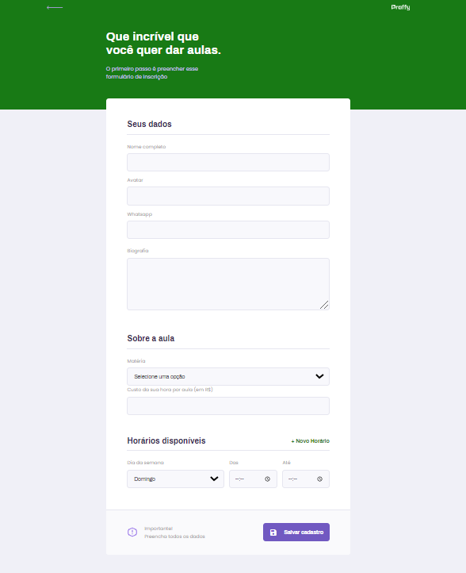
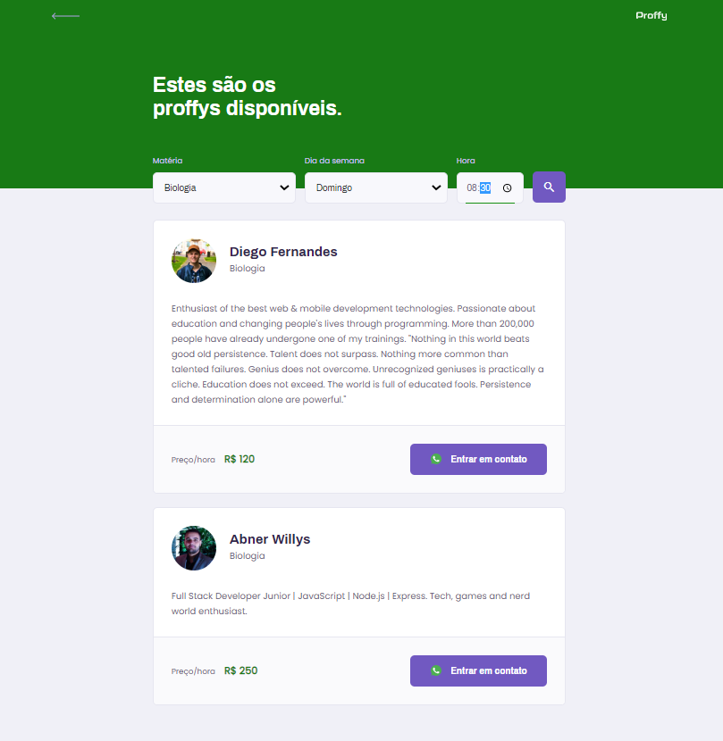

<h1 align="center">
    
</h1>


<p align="center">
  <a href="https://www.linkedin.com/in/abnerwillys/">
    
  </a>

  

  <a href="https://rocketseat.com.br/">
    
  </a>

  <a href="https://www.javascript.com/">
    
  </a>
</p>

---

<p align="center">
 <a href="#-sobre">Sobre</a> •
 <a href="#-etapas-do-projeto">Etapas do projeto</a> • 
 <a href="#-tecnologias-utilizadas">Tecnologias</a> • 
 <a href="#-como-baixar-o-projeto">Como baixar o projeto</a> • 
 <a href="#-licença">Licença</a> • 
 <a href="#-desenvolvedor">Desenvolvedor</a>
</p>

---
### 🔖 Sobre

O projeto **Proffy** de estudos online, onde é possivel conectar alunos com professores.

Esse projeto foi proposto durante a **Next Level Week #2** na *trilha Discovery (confira a Trilha OmniStack [clicando Aqui](https://github.com/abner-starkasty/Proffy-Typescript))*, lecionado pela **@Rocketseat**. O projeto foi desenvolvido em diversas etapas conforme o decorrer do evento, com o objetivo de apresentar os principais pontos de um projeto real desenvolvido na stack JavaScript.

Neste projeto foi utilizado a metodologia 📲 **Mobile First.** 📲

<p align="center">
    
    
</p>

#### 🎬 Breve vizualização

<p align="center">
    <a href="https://www.youtube.com/watch?v=64nT16NwF04&feature=youtu.be">
        
    </a>
</p>

---
### 📝 Etapas do projeto

 - [x] 💯 Front end;
 - [x] 💯 Finalizando front end;
 - [x] 💯 Back end;
 - [x] 💯 Finalizando Back end;
 - [x] 💯 Construindo Banco de dados.

---
### 🛠 Tecnologias utilizadas


As seguintes tecnologias/ferramentas foram utilizadas:

- [JavaScript](https://www.javascript.com/);
    - [CSS3](https://developer.mozilla.org/en-US/docs/Web/CSS);
    - [HTML5](https://developer.mozilla.org/en-US/docs/Web/HTML);
- [Node.js](https://nodejs.org/en/);
    - [Express](https://expressjs.com/);
- [NunJucks](https://mozilla.github.io/nunjucks/);
- [SQLite](https://www.sqlite.org/index.html);
- [Git](https://git-scm.com/);
- [Figma](https://www.figma.com/);
- [VSCode](https://code.visualstudio.com/);


---
### 📎 Como baixar o projeto

##### 👉 Ferramentas necessárias:
- Editor:
    - [Vscode](https://code.visualstudio.com/) foi utilizado nesse projeto; 
- [Node.Js](https://nodejs.org/en/) - Instalado em sua máquina;
- [Git](https://git-scm.com/downloads) - Instalado em sua máquina;

##### 👉 Após instalar as ferramentas:

```bash

#->No terminal:

# Clonar repositório:
$ git clone https://github.com/abner-starkasty/Proffy-Javascript

# Entrar no diretório do projeto:
-> $ cd proffy-javascript

# Instalar dependências
$ npm install

# Iniciar o projeto
$ npm start

```


---
### 📜 Licença

Esse projeto está sob a licença MIT. Veja o arquivo [LICENSE](LICENSE) para mais detalhes.

---

### 👨‍💻 Desenvolvedor

<p align="center">
    <a href="https://blog.rocketseat.com.br/author/thiago/">
        
        <br/>
        <sub><b>Abner Willys  🚀</b></sub>
    </a>
</p>
</br>
<h6 align="center">
    Feito com 💜 por Abner Willys 🙌 Entre em contato 😊🤓
</h6>

<p align="center">
    <a href="https://www.linkedin.com/in/abnerwillys/">
        
    </a>
    <a href="https://twitter.com/AbnerStarkasty">
        
    </a>
    <a href="mailto:tgmarinho@gmail.com">
        
    </a>
    <a href="https://www.facebook.com/abnerwillys">
        
    </a>
    <a href="https://bit.ly/3eC6MX5">
        
    </a>
</p>
